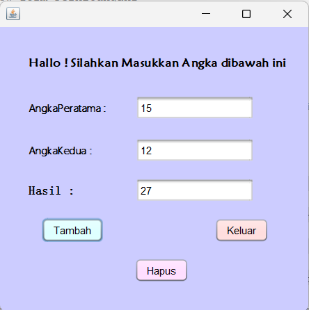

# Latihan1Pertambahan2Angka
 Latihan1_NovitaFitriaRatnawati_2210010228
 
# Aplikasi Pertambahan dua angka
 
Aplikasi pertambahan dua angka adalah aplikasi untuk menambah dari inputan dua angka textfield

# Keunggulan Aplikasi

- Pertambahan dua angka: Aplikasi ini memiliki button hapus untuk menghapus angka 

# Pembuat Aplikasi
 Novita Fitria Ratnawati - 2210010228 - Latihan 1

# Fitur

Aplikasi ini menawarkan fitur:
Pertambahan dua angka

## Cara Menjalankan

1. Run File
2. Ketikkan Angka 1 Yang Kita Input
3. Ketikkan Angka 2 Yang Kita Input
4. Tekan Button Tambah, Maka akan keluar hasilnya
5. Tekan Button Hapus untuk mengulang pertambahan
6. Tekan Button Keluar, jika ingin keluar 

# Demo
